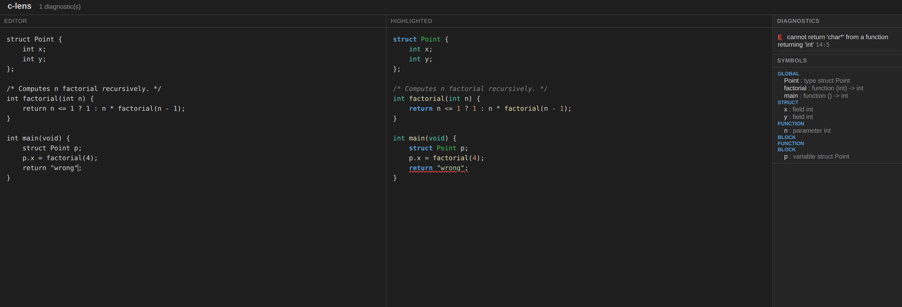
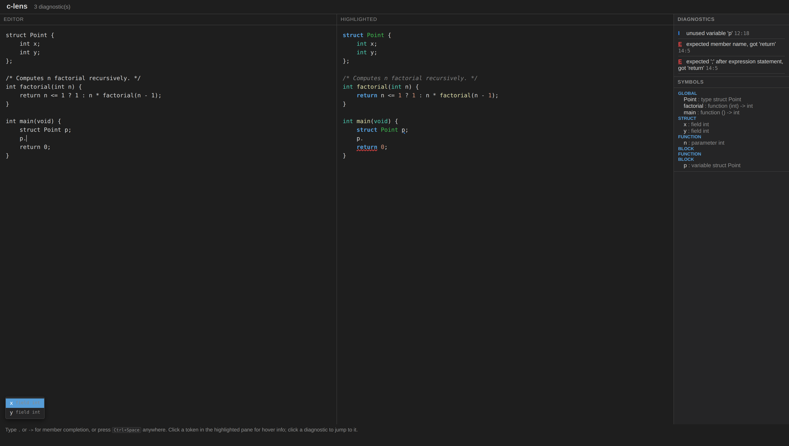
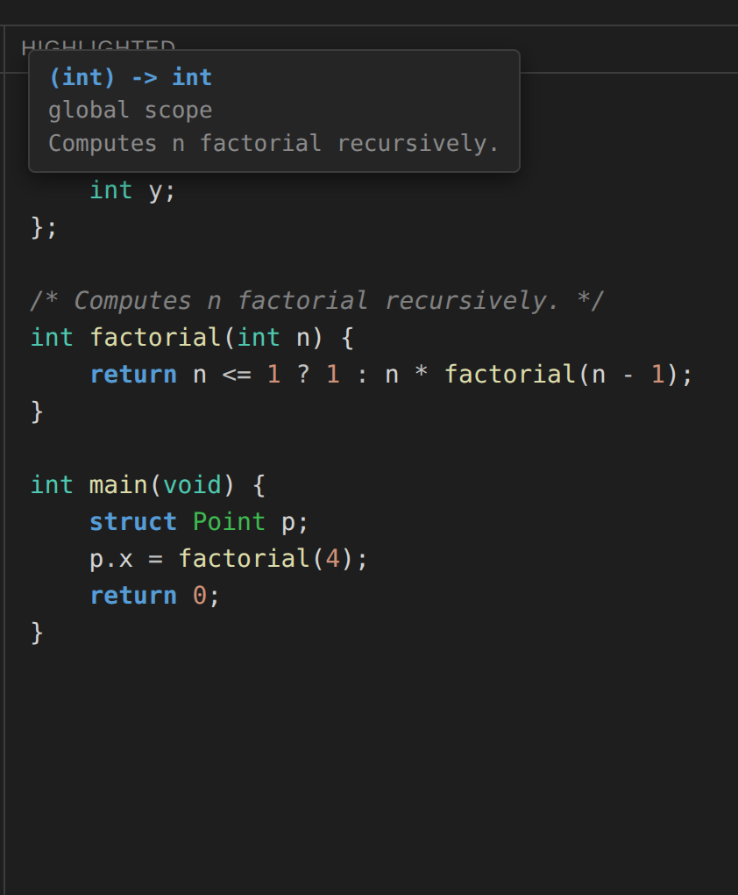
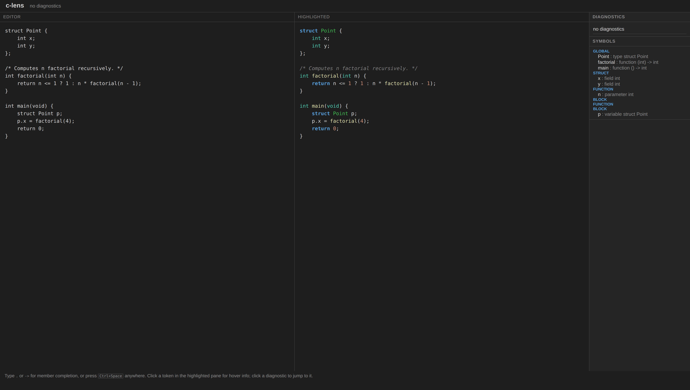
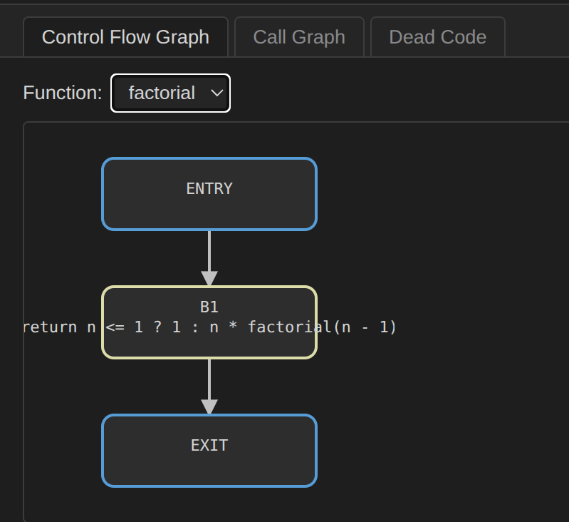
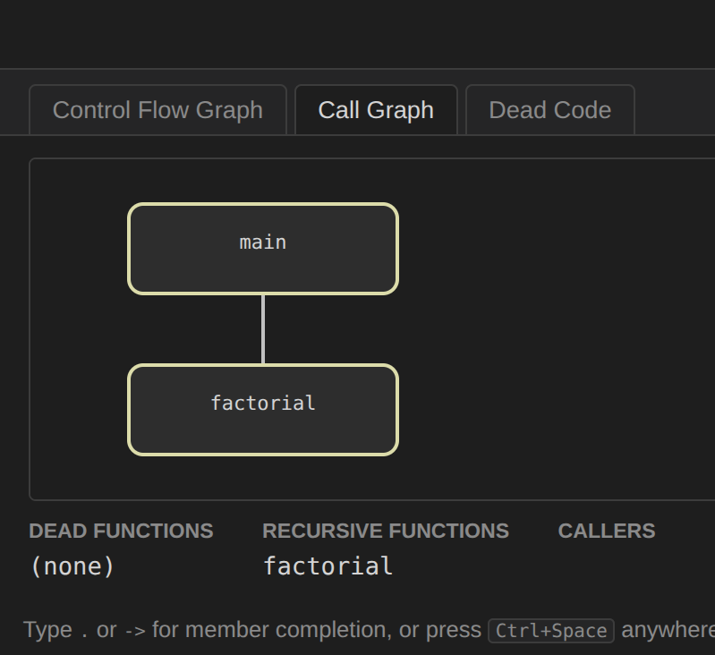
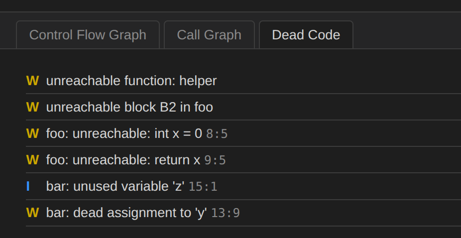

# clens


**clens** is a code-aware IDE feature set for a subset of C, built from scratch:
a hand-written lexer, a recursive-descent parser, an AST, a syntax highlighter
that consults the AST instead of just the token stream (so it can tell a
function call apart from a bare variable reference, which a regex-based
highlighter cannot do), two-pass name resolution, a semantic type checker,
an auto-completion and hover engine, control-flow graphs, three data-flow
analyses, a program-wide call graph, go-to-definition/find-all-references,
scope-aware safe rename, dead-code detection, and an interactive web UI
covering all of the above.

This is **Phase 1, 2, and 3** — all three phases of this university Compiler
Design project. See `docs/architecture.md` for the full pipeline and module
map, `docs/program-analysis.md` for the Phase 3 analysis algorithms, and
`docs/future-work.md` for what was deliberately scoped out and why.

## Pipeline

```
SourceFile ─► Lexer ─► tokens ─► Parser ─► AST ─┬─► Highlighter ─► HighlightMap
                                                 │                       │
                                                 │                       ▼
                                                 │        render/ansi.py, render/html.py,
                                                 │        web/renderer.py
                                                 │
                                                 └─► analyze() ─► SemanticModel ─┬─► completions_at,
                                                     (resolution,                │   hover_at, goto-def,
                                                      type checking,             │   find-refs
                                                      usage checks)              │   (languages/c/queries.py)
                                                                                  │
                                                                                  └─► analyze_program() ─► ProgramAnalysis
                                                                                      (cfgs, call graph,   (cfgs, call_graph,
                                                                                       data-flow)           dataflow) ─► rename,
                                                                                                                        dead-code,
                                                                                                                        CFG/call-graph SVG
```

Every stage feeds one shared `DiagnosticCollector`. Nothing raises past its own
boundary — a file with lexical, syntax, *or* semantic errors still gets
highlighted, resolved, and type-checked for everything that *did* work. See
`docs/architecture.md` for the full module-by-module breakdown (including the
complete Phase 3 diagram), `docs/semantic-analysis.md` / `docs/type-system.md`
for the Phase 2 passes, and `docs/program-analysis.md` for the CFG/data-flow/
call-graph algorithms.

## Install

```bash
git clone https://github.com/SepehrGhr/clens.git
cd clens
python3 -m venv .venv && source .venv/bin/activate
pip install -e .
```

Or with Docker (no local Python needed):

```bash
docker build -t clens .
docker run --rm clens --help
```

## Quickstart

```bash
clens tokens <file.c>                                   # dump the token stream
clens ast <file.c>                                      # pretty-print the AST
clens highlight <file.c>                                 # ANSI-colored, to your terminal
clens highlight <file.c> --format html -o out.html        # self-contained HTML file
clens check <file.c>                                      # lexer + parser + semantic diagnostics
clens symbols <file.c>                                    # the scope tree and symbol table
clens complete <file.c> <line> <col>                       # completion list at a cursor
clens hover <file.c> <line> <col>                          # signature, scope, doc comment
clens goto-def <file.c> <line> <col>                       # jump to a symbol's definition
clens find-refs <file.c> <symbol-name>                     # every reference to a symbol, by name
clens rename <file.c> <line> <col> <new-name>              # scope-aware safe rename; prints a diff, add --apply to write
clens show-cfg <file.c> <function>                         # a function's control flow graph
clens show-cfg <file.c> <function> --format svg -o out.svg # ...as an SVG
clens callgraph <file.c>                                   # the program's call graph
clens dead-code <file.c>                                   # unreachable code, unused vars, dead assignments
clens serve --port 8000                                    # interactive web UI at 127.0.0.1:8000
```

Every subcommand accepts `--json` for machine-readable output and `-o FILE` to
write to a file instead of stdout (`serve` has neither — it's not file-based).
Exit codes: `0` clean, `1` diagnostics with
an error present, `2` internal failure (meant to be unreachable — the tool
never crashes, see `docs/known-limitations.md` and rule 1 in
`.agents/AGENTS.md`).

## Usage, with real output

`clens ast tests/fixtures/valid/factorial.c`:

```
Program
  declarations[0]: FuncDecl(name='factorial')
    return_type: TypeSpec(base='int', struct_name=None, pointer_depth=0, is_const=False, storage=None)
    params[0]:   Param(name='n')
      type: TypeSpec(base='int', struct_name=None, pointer_depth=0, is_const=False, storage=None)
    body:        Block
      body[0]: IfStmt
        condition:   BinaryExpr(op='<=')
          left:  Identifier(name='n', loc=2:9)
          right: IntLiteral(value=1, loc=2:14)
        then_branch: ReturnStmt
          value: IntLiteral(value=1, loc=2:24)
      body[1]: ReturnStmt
        value: BinaryExpr(op='*')
          left:  Identifier(name='n', loc=3:12)
          right: CallExpr(callee='factorial', loc=3:16)
            args[0]: BinaryExpr(op='-')
              left:  Identifier(name='n', loc=3:26)
              right: IntLiteral(value=1, loc=3:30)
```

`clens check` on a file with a syntax error — position, message, and a caret
under the exact offending column, then recovery continues past it:

```
$ clens check tests/fixtures/syntax-errors/missing_expression.c
tests/fixtures/syntax-errors/missing_expression.c:1:9: error: expected expression, got ';'
  1 | int x = ;
    |         ^
$ echo $?
1
```

`clens check` on the course document's own four worked type-checking
examples (§5.3.1) — one warning, three errors, exactly as specified:

```
$ clens check tests/fixtures/semantic-errors/golden_four.c
tests/fixtures/semantic-errors/golden_four.c:9:9: warning: conversion from 'double' to 'int' may lose precision
  9 | int x = 3.14;
    |         ^^^^
tests/fixtures/semantic-errors/golden_four.c:10:11: error: cannot assign 'int' to 'char*'
  10 | char *s = 42;
     |           ^^
tests/fixtures/semantic-errors/golden_four.c:11:19: error: argument 1: expected 'int', got 'char*'
  11 | int y = factorial("hello");
     |                   ^^^^^^^
tests/fixtures/semantic-errors/golden_four.c:12:18: error: void function should not return a value
  12 | void foo(void) { return 5; }
     |                  ^^^^^^^^^
$ echo $?
1
```

`clens highlight` renders `int factorial(int n) { ... }` with the function's
own name and its recursive call both colored as `function`, while the plain
variable `n` stays the default `variable` color — the same identifier used two
different ways gets two different colors, because the highlighter walks the
AST, not just the token stream. See the rendered
[`factorial.c` on GitHub Pages](https://sepehrghr.github.io/clens/) (published
by CI on every push to `main`) or `tests/golden/expected/factorial.html`
locally.

## Web UI

`clens serve` starts an interactive editor at `http://127.0.0.1:8000/` — a
stdlib `http.server` backend (no Flask, no third-party dependency) driving a
vanilla-JS front end: a plain `<textarea>` next to the AST-driven highlighted
pane, re-analyzed on every keystroke (~300ms debounced).

```bash
clens serve --port 8000
```

Live diagnostics, with squiggles on the offending tokens and click-to-jump:



Member completion, triggered by typing `.` / `->` (or Ctrl+Space anywhere):



Hover a token in the highlighted pane for its signature, enclosing scope, and
attached doc comment:



The full picture — editor, highlighted pane, and the live scope/symbol
tree on the right:



Three more tabs, added in Phase 3: a function's control-flow graph, the
whole program's call graph (click a node to jump to its definition or see
its callers), and a dead-code report — all rendered as SVG, generated by
the same `core/graph_layout.py` + `render/svg.py` pair the CLI's
`--format svg` uses:





See [`docs/bonus/web-ui.md`](docs/bonus/web-ui.md) for the full writeup —
this interface is also what satisfies the Phase 3 requirement for an
interactive way to reach navigation/CFG/call-graph features.

## Documentation

| Doc | Contents |
|---|---|
| [`docs/architecture.md`](docs/architecture.md) | Pipeline, module map, parsing-strategy justification, data structures |
| [`docs/grammar.ebnf`](docs/grammar.ebnf) | The complete EBNF for the implemented C subset |
| [`docs/first-follow.md`](docs/first-follow.md) | FIRST/FOLLOW sets and the documented ambiguity resolutions |
| [`docs/lexical-specification.md`](docs/lexical-specification.md) | Formal regexes per token class, the NFA→DFA→minimization theory, a worked example |
| [`docs/semantic-analysis.md`](docs/semantic-analysis.md) | The scope model, the two-pass resolution algorithm, the symbol table, worked example |
| [`docs/type-system.md`](docs/type-system.md) | The `Type` hierarchy, conversion rules, per-node typing table, `UnknownType`/no-cascade |
| [`docs/program-analysis.md`](docs/program-analysis.md) | CFG construction, the three data-flow analyses (direction/lattice/transfer/join), call-graph queries |
| [`docs/known-limitations.md`](docs/known-limitations.md) | Every excluded feature and every approximation across all three phases, with its reason |
| [`docs/testing.md`](docs/testing.md) | Copy-pasteable instructions to set up, run, and reproduce every test |
| [`docs/team.md`](docs/team.md) | Module ownership split |
| [`docs/third-party.md`](docs/third-party.md) | pycparser, credited as a design reference |
| [`docs/bonus/README.md`](docs/bonus/README.md) | Index of every delivered bonus feature, with a four-section writeup each |
| [`docs/future-work.md`](docs/future-work.md) | Deferred items — what, why, effort, and where each plugs in |
| [`.agents/`](.agents/) | The full agent working environment this project was built from: requirements, decisions, skills |

## Development

```bash
pip install -e . -r requirements-dev.txt
pytest --cov=src/clens --cov-report=term-missing   # tests + coverage
ruff check . && ruff format --check .                # lint
```

Full details in [`docs/testing.md`](docs/testing.md).
