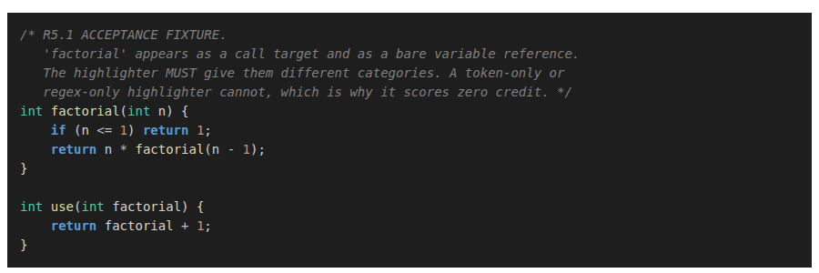
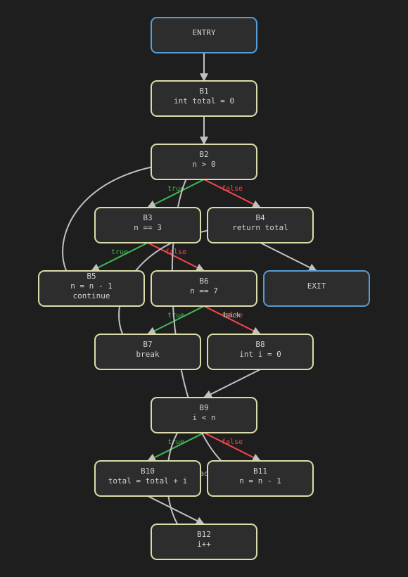
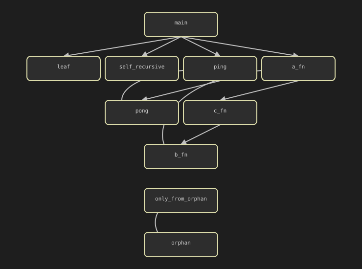

# Full feature demo

Every command `clens` has, in the order its pipeline stage was built:
Phase 1 (lexer → parser → AST → highlighter), Phase 2 (name resolution →
type checking → completion/hover), Phase 3 (navigation → rename →
CFG/data-flow → call graph → dead-code → web UI). For each one: the exact
command, a short note on how it's actually implemented, and one or more
real examples run against a fixture already in this repo — every output
below is copy-pasted from a real run, not hand-written.

This file exists so a presentation doesn't need to improvise a live
terminal demo with untested input: run any command below yourself to
reproduce it, or just show this file and the linked screenshots.

**Setup**, once:

```bash
git clone https://github.com/SepehrGhr/clens.git && cd clens
pip install -e .
```

All commands below are run from the repo root. Every command also accepts
`--json` for machine-readable output and `-o FILE` to write to a file
instead of stdout — shown explicitly only where the JSON shape itself is
the interesting part.

## Contents

**Phase 1 — Lexer, parser, AST, highlighter**
[Tokens](#1-tokens) · [AST](#2-ast) · [Lexical errors](#3-check--lexical-errors) ·
[Syntax errors](#4-check--syntax-errors) · [Highlighter](#5-highlight)

**Phase 2 — Semantic analysis**
[Type/name diagnostics](#6-check--semantic-diagnostics) · [Symbol table](#7-symbols) ·
[Completion](#8-complete) · [Hover](#9-hover)

**Phase 3 — Navigation, refactoring, program analysis, web UI**
[Go to definition](#10-goto-def) · [Find references](#11-find-refs) ·
[Rename](#12-rename) · [Control-flow graph](#13-show-cfg) ·
[Data-flow: definite assignment](#14-data-flow-definite-assignment) ·
[Call graph](#15-callgraph) · [Dead-code detection](#16-dead-code) ·
[Reaching definitions (bonus)](#17-reaching-definitions-bonus) ·
[Web UI](#18-web-ui)

---

## 1. Tokens

```bash
clens tokens <file.c>
```

**Implementation.** `core/lexer_base.py` is a language-agnostic
master-regex scanner: it tries an ordered list of `TokenRule`s at the
current position and takes the first/longest match (maximal munch).
`languages/c/lexer.py` supplies the C rule table and a retype callback
that first matches an identifier, then reclassifies it to `KEYWORD` if
the lexeme is in the keyword set — so a rule table never has to special-
case `if`/`while`/etc. as their own regexes.

**Example** — `tests/fixtures/valid/factorial.c`:

```
$ clens tokens tests/fixtures/valid/factorial.c
1:1 KEYWORD 'int'
1:4 WHITESPACE ' '
1:5 IDENT 'factorial'
1:14 DELIMITER '('
1:15 KEYWORD 'int'
1:18 WHITESPACE ' '
1:19 IDENT 'n'
1:20 DELIMITER ')'
1:21 WHITESPACE ' '
1:22 DELIMITER '{'
...
2:5 KEYWORD 'if'
2:8 DELIMITER '('
2:9 IDENT 'n'
2:11 OPERATOR '<='
2:14 INT_LIT '1'
...
```

(trimmed — full output is one line per token, including whitespace/
comment trivia, ending in an `EOF` token.)

## 2. AST

```bash
clens ast <file.c>
```

**Implementation.** `languages/c/parser.py` is recursive-descent: one
function per grammar non-terminal in `docs/grammar.ebnf`, named
`parse_<name>`. Expression precedence is a cascade (assignment → ternary
→ logical-or → … → primary); every binary level is a **loop**, not
recursion on the left, which is what keeps the grammar left-recursion-
free and gives left-associativity for free.

**Example** — `tests/fixtures/valid/factorial.c`:

```
$ clens ast tests/fixtures/valid/factorial.c
Program
  declarations[0]: FuncDecl(name='factorial')
    return_type: TypeSpec(base='int', struct_name=None, pointer_depth=0, is_const=False, storage=None)
    params[0]:   Param(name='n')
      type: TypeSpec(base='int', struct_name=None, pointer_depth=0, is_const=False, storage=None)
    body:        Block
      body[0]: IfStmt
        condition:   BinaryExpr(op='<=')
          left:  Identifier(name='n', loc=2:9)
          right: IntLiteral(value=1, loc=2:14)
        then_branch: ReturnStmt
          value: IntLiteral(value=1, loc=2:24)
      body[1]: ReturnStmt
        value: BinaryExpr(op='*')
          left:  Identifier(name='n', loc=3:12)
          right: CallExpr(callee='factorial', loc=3:16)
            args[0]: BinaryExpr(op='-')
              left:  Identifier(name='n', loc=3:26)
              right: IntLiteral(value=1, loc=3:30)
```

## 3. `check` — lexical errors

```bash
clens check <file.c>
```

**Implementation.** `tokenize()` writes lexer-level diagnostics
(unrecognized character, unterminated string/comment) into the same
`DiagnosticCollector` the parser and semantic passes share. A bad
character produces a recovery token *and* a diagnostic, so scanning keeps
going instead of aborting — the rest of the file still gets tokenized.

**Example 1** — an unrecognized character:

```
$ clens check tests/fixtures/lexical-errors/invalid_char.c
tests/fixtures/lexical-errors/invalid_char.c:1:6: error: unrecognized character '@'
  1 | int x@ = 5;
    |      ^
tests/fixtures/lexical-errors/invalid_char.c:1:6: error: expected ';' after variable declaration, got '@'
  1 | int x@ = 5;
    |      ^
$ echo $?
1
```

**Example 2** — an unterminated string literal (note recovery continues
into the *next* statement and even flags the now-unused `y`):

```
$ clens check tests/fixtures/lexical-errors/unterminated_string.c
tests/fixtures/lexical-errors/unterminated_string.c:2:15: error: unterminated string literal
  2 |     char *s = "hello;
    |               ^
tests/fixtures/lexical-errors/unterminated_string.c:3:5: error: expected ';' after variable declaration, got 'int'
  3 |     int y = 10;
    |     ^^^
tests/fixtures/lexical-errors/unterminated_string.c:3:9: info: unused variable 'y'
  3 |     int y = 10;
    |         ^
```

**Example 3** — an unterminated block comment:

```
$ clens check tests/fixtures/lexical-errors/unterminated_block_comment.c
tests/fixtures/lexical-errors/unterminated_block_comment.c:2:1: error: unterminated block comment
  2 | /* this comment never ends
    | ^^
```

## 4. `check` — syntax errors

**Implementation.** `core/parser_base.py`'s `expect()`/`fail()` raise an
internal `ParseError` on a mismatch. It's caught at the nearest
statement/declaration boundary, where `synchronize()` discards tokens up
to a synchronization lexeme (`;`, `}`, or a declaration-starting keyword)
— panic-mode recovery, so one broken construct doesn't take the rest of
the file down with it (a partial AST plus diagnostics is always returned,
never an exception to the caller).

**Example 1** — a single, precise error with a caret:

```
$ clens check tests/fixtures/syntax-errors/missing_expression.c
tests/fixtures/syntax-errors/missing_expression.c:1:9: error: expected expression, got ';'
  1 | int x = ;
    |         ^
```

**Example 2** — a missing closing paren; recovery re-synchronizes but the
cascade shows exactly how far one malformed `if` can ripple before the
next synchronization point:

```
$ clens check tests/fixtures/syntax-errors/missing_paren.c
tests/fixtures/syntax-errors/missing_paren.c:3:5: error: expected ')' to close 'if' condition, got '{'
  3 |     {
    |     ^
tests/fixtures/syntax-errors/missing_paren.c:6:5: error: expected a type, got 'return'
  6 |     return 0;
    |     ^^^^^^
tests/fixtures/syntax-errors/missing_paren.c:6:12: error: expected a type, got '0'
  6 |     return 0;
    |            ^
tests/fixtures/syntax-errors/missing_paren.c:7:1: error: expected a type, got '}'
  7 | }
    | ^
```

**Example 3** — a construct deliberately out of scope (`typedef`) gets one
clear diagnostic instead of a wall of noise, and the *next* function still
parses cleanly:

```
$ clens check tests/fixtures/syntax-errors/unsupported_typedef.c
tests/fixtures/syntax-errors/unsupported_typedef.c:4:1: error: unsupported construct: 'typedef' (see docs/known-limitations.md)
  4 | typedef int myint;
    | ^^^^^^^
```

## 5. `highlight`

```bash
clens highlight <file.c>                            # ANSI, to your terminal
clens highlight <file.c> --format html -o out.html   # self-contained HTML
```

**Implementation.** `languages/c/highlighter.py` runs two passes over the
same token list. Pass 1 assigns the obvious category from a token's own
type/lexeme (keyword, type, number, string, comment, operator; an
`IDENT` defaults to `variable`) — this is the *ceiling* of what a
token-only or regex-only highlighter can ever do. Pass 2 walks the AST and
upgrades specific identifier *tokens* using context only the parse tree
has: a `CallExpr`'s callee becomes `function`, a `FuncDecl`'s own name
becomes `function`, a struct tag becomes `type`. Pass 2 only ever
overwrites pass 1, never the reverse.

**Example** — `tests/fixtures/valid/call_vs_variable.c`, the project's own
acceptance fixture for this: the identifier `factorial` appears four
times — as the function's own name, as a recursive call, as a parameter
name, and as a plain read of that parameter. Lexically these are four
identical `IDENT` tokens; a token-only highlighter cannot tell them apart.
`--json` proves the real category assigned to each token index:

```
$ clens highlight tests/fixtures/valid/call_vs_variable.c --json
[
  ...
  { "token_index": 4,  "category": "function" },   /* int factorial(...) { -- the declaration */
  ...
  { "token_index": 34, "category": "function" },   /* factorial(n - 1)    -- the recursive call */
  ...
  { "token_index": 48, "category": "function" },   /* int use(...)        -- use's own name */
  ...
  { "token_index": 52, "category": "variable" },   /* int use(int factorial) -- the parameter */
  ...
  { "token_index": 59, "category": "variable" },   /* return factorial + 1;  -- reading it */
  ...
]
```

Same lexeme (`factorial`), same token type (`IDENT`), two different
categories depending on how it's actually used — which is the whole
reason this highlighter walks the AST. The rendered ANSI escape codes for
the two `factorial(...)` occurrences (declaration and recursive call) are
byte-identical to each other and different from the two parameter
occurrences:

```
$ clens highlight tests/fixtures/valid/call_vs_variable.c | cat -v | sed -n '5p;10p'
^[[38;2;78;201;176mint^[[0m ^[[38;2;220;220;170mfactorial^[[0m(^[[38;2;78;201;176mint^[[0m ^[[38;2;212;212;212mn^[[0m) {
^[[38;2;78;201;176mint^[[0m ^[[38;2;220;220;170muse^[[0m(^[[38;2;78;201;176mint^[[0m ^[[38;2;212;212;212mfactorial^[[0m) {
```

`38;2;220;220;170` (function, gold) vs. `38;2;212;212;212` (variable,
light grey) — the same distinction the JSON above shows, applied as
actual color.


This is exactly the same `HighlightMap`, rendered a second way — the
`--format html` self-contained output, opened in a browser:



Also reachable from the **web UI**'s editor pane, live, on every keystroke
(§18).

---

## 6. `check` — semantic diagnostics

```bash
clens check <file.c>
```

**Implementation.** Two-pass name resolution (`languages/c/resolver.py`):
pass 1 scans every top-level declaration into the global scope *before*
any function body is walked — this is what makes forward calls, mutual
recursion, and out-of-order globals resolve. Pass 2 then walks bodies
against that already-complete global scope, building the rest of the
scope tree and recording a `Reference` at every use. Type checking
(`languages/c/typecheck.py`) walks the resolved AST bottom-up, annotating
every expression's `type_annotation` and applying C's assignability and
usual-arithmetic-conversion rules. An `UnknownType` produced by an earlier
error suppresses further errors on the same expression, so one root cause
doesn't cascade into a page of noise.

**Example 1** — the four canonical type-checking cases in one file: an
implicit narrowing warning, an incompatible assignment, a wrong argument
type, and a `void` function returning a value:

```
$ clens check tests/fixtures/semantic-errors/golden_four.c
tests/fixtures/semantic-errors/golden_four.c:9:9: warning: conversion from 'double' to 'int' may lose precision
  9 | int x = 3.14;
    |         ^^^^
tests/fixtures/semantic-errors/golden_four.c:10:11: error: cannot assign 'int' to 'char*'
  10 | char *s = 42;
     |           ^^
tests/fixtures/semantic-errors/golden_four.c:11:19: error: argument 1: expected 'int', got 'char*'
  11 | int y = factorial("hello");
     |                   ^^^^^^^
tests/fixtures/semantic-errors/golden_four.c:12:18: error: void function should not return a value
  12 | void foo(void) { return 5; }
     |                  ^^^^^^^^^
```

**Example 2** — shadowing at three nesting depths (a *warning*, not an
error — C allows it):

```
$ clens check tests/fixtures/semantic-errors/shadowing.c
tests/fixtures/semantic-errors/shadowing.c:7:13: warning: declaration of 'x' shadows an outer declaration at 4:11
  7 |         int x = 2;      /* shadows the parameter */
    |             ^
tests/fixtures/semantic-errors/shadowing.c:7:13: info: unused variable 'x'
  7 |         int x = 2;      /* shadows the parameter */
    |             ^
tests/fixtures/semantic-errors/shadowing.c:9:17: warning: declaration of 'x' shadows an outer declaration at 7:13
  9 |             int x = 3;  /* shadows the block-level x */
    |                 ^
```

**Example 3** — duplicate declaration in the *same* scope is a hard
error, contrasted with shadowing (an inner-scope redeclaration) which is
not:

```
$ clens check tests/fixtures/semantic-errors/duplicate_declaration.c
tests/fixtures/semantic-errors/duplicate_declaration.c:5:9: info: unused variable 'a'
  5 |     int a = 1, a = 2;
    |         ^
tests/fixtures/semantic-errors/duplicate_declaration.c:5:16: error: 'a' is already declared at 5:9
  5 |     int a = 1, a = 2;
    |                ^
tests/fixtures/semantic-errors/duplicate_declaration.c:6:9: info: unused variable 'b'
  6 |     int b = 0;
    |         ^
tests/fixtures/semantic-errors/duplicate_declaration.c:7:9: error: 'b' is already declared at 6:9
  7 |     int b = 1;
    |         ^
tests/fixtures/semantic-errors/duplicate_declaration.c:9:13: warning: declaration of 'b' shadows an outer declaration at 6:9
  9 |         int b = 2;   /* shadowing warning, NOT duplicate */
    |             ^
```

**Example 4** — an undefined symbol used five times still gets exactly
*one* diagnostic (no-cascade, S9.2):

```
$ clens check tests/fixtures/semantic-errors/undefined_symbol.c
tests/fixtures/semantic-errors/undefined_symbol.c:4:5: error: undefined symbol 'counter'
  4 |     counter = 1;
    |     ^^^^^^^
```

Also reachable from the **web UI** as live squiggles on the offending
tokens, click-to-jump (§18):


## 7. `symbols`

```bash
clens symbols <file.c>
```

**Implementation.** Dumps the scope tree the two-pass resolver built: one
`Scope` node per lexical region — global, function, block, and a
dedicated `for`-init scope for a `for` loop's own declarations — each
holding its own symbol table. Struct scopes exist but hang off the struct
declaration, not the lexical chain, since a member is looked up by member
access, never by ordinary name lookup.

**Example** — `tests/fixtures/valid/scopes.c`, chosen for nested blocks
and a `for`-init scope:

```
$ clens symbols tests/fixtures/valid/scopes.c
GLOBAL
  g: variable int
  outer: function (int) -> int
  FUNCTION
    p: parameter int
    BLOCK
      a: variable int
      BLOCK
        b: variable int
        BLOCK
          c: variable int
      FOR_INIT
        i: variable int
        j: variable int
        BLOCK
```

## 8. `complete`

```bash
clens complete <file.c> <line> <col>
```

**Implementation.** `completions_at` finds the scope enclosing the cursor
offset, then branches on context: after a `.`/`->` it resolves the base
expression's static type and offers exactly that struct's fields; bare
identifier context instead walks the scope chain outward and lists every
symbol visible from there. Results are ranked prefix matches first, then
fuzzy.

**Example** — cursor right after the `.` in `p.x = 1;`
(`tests/fixtures/valid/member_completion.c`, line 14, column 7), where
`p` is a `struct Point { int x; int y; }`:

```
$ clens complete tests/fixtures/valid/member_completion.c 14 7
x  field  int
y  field  int
```

Exactly the struct's two members, nothing from the enclosing function's
scope — proof this is a real member-completion branch, not a dump of
every visible symbol.

Also reachable from the **web UI**, triggered by typing `.`/`->` or
Ctrl+Space anywhere (§18):


## 9. `hover`

```bash
clens hover <file.c> <line> <col>
```

**Implementation.** `hover_at` resolves the token under the cursor to its
`Symbol`, then formats a signature, an enclosing-scope description, and
an attached doc comment. The doc comment is found by walking backward
from the declaration to the nearest contiguous `/* */` or `//` run and
stripping delimiters/leading asterisks — a `//` run spanning multiple
lines is joined into one comment.

**Example** — hovering `factorial`'s own name at its definition
(`tests/fixtures/valid/doc_comments.c`, line 5, column 5):

```
$ clens hover tests/fixtures/valid/doc_comments.c 5 5
(int) -> int
global scope
Computes n factorial recursively.
```

Also reachable from the **web UI** as a hover card on click (§18):


---

## 10. `goto-def`

```bash
clens goto-def <file.c> <line> <col>
```

**Implementation.** Resolves the token under the cursor to its `Symbol`
and reports `Symbol.definition_loc` — the span recorded the first time
the two-pass resolver saw the declaration.

**Example** — `tests/fixtures/valid/forward_reference.c` declares
`later` as a prototype on line 2, then calls it from inside `earlier`
(line 5) *before* `later`'s real definition on line 8. Jumping from that
call (line 5, column 12) lands on the **prototype** at line 2 — proof
that pass 1's declaration scan had already registered `later` as a symbol
before `earlier`'s body was ever walked, which is exactly what makes the
forward call resolve at all:

```
$ clens goto-def tests/fixtures/valid/forward_reference.c 5 12
later (function (int) -> int) defined at tests/fixtures/valid/forward_reference.c:2:5
```

## 11. `find-refs`

```bash
clens find-refs <file.c> <symbol-name>
```

**Implementation.** Looks up every `Symbol` matching the given name —
there can be more than one, since the same name can be declared in
different, unrelated scopes — and returns each one's own reference list
(`Symbol.references`), recorded once during resolution, never a fresh
text scan.

**Example** — `.agents/fixtures/analysis/rename_target.c` declares three
*different* symbols all named `n`: a parameter of `factorial`, a
parameter of `other`, and a local variable inside `shadow_demo`.
`find-refs n` reports all three as separate symbols, each with its own
reference list — proof this is scope-aware symbol identity, not a
name grep:

```
$ clens find-refs .agents/fixtures/analysis/rename_target.c n
n (parameter int) defined at .agents/fixtures/analysis/rename_target.c:10:19
  .agents/fixtures/analysis/rename_target.c:12:9
  .agents/fixtures/analysis/rename_target.c:13:12
  .agents/fixtures/analysis/rename_target.c:13:26

n (parameter int) defined at .agents/fixtures/analysis/rename_target.c:16:15
  .agents/fixtures/analysis/rename_target.c:17:12
  .agents/fixtures/analysis/rename_target.c:17:16

n (variable int) defined at .agents/fixtures/analysis/rename_target.c:21:9
  .agents/fixtures/analysis/rename_target.c:21:9
  .agents/fixtures/analysis/rename_target.c:23:21
```

## 12. `rename`

```bash
clens rename <file.c> <line> <col> <new-name>   # prints a diff
clens rename <file.c> <line> <col> <new-name> --apply   # writes it
```

**Implementation.** *"A simple text-substitution approach is not
acceptable"* — every span this rewrites comes from the target `Symbol`'s
`definition_loc` and `references`, never from scanning source text for a
name. Before writing anything it refuses if the new name already exists
in the same scope (a collision) or in any scope the symbol's scope is
nested inside (would newly shadow an outer declaration) — a hard stop,
not a silently-introduced bug. On success it produces a unified diff
(`difflib`) of the fully rewritten source; nothing is written to disk
unless `--apply` is passed.

**Example 1** — renaming `factorial`'s parameter `n` (line 10, column 19)
to `number`. `other` and `shadow_demo` also declare a local named `n`,
but the diff touches **only** `factorial`'s three occurrences:

```
$ clens rename .agents/fixtures/analysis/rename_target.c 10 19 number
--- .agents/fixtures/analysis/rename_target.c
+++ .agents/fixtures/analysis/rename_target.c
@@ -7,10 +7,10 @@
      - renaming factorial's `n` to `g` would shadow the global */
 int g = 0;

-int factorial(int n) {
+int factorial(int number) {
     int result = 1;
-    if (n <= 1) return 1;
-    return n * factorial(n - 1);
+    if (number <= 1) return 1;
+    return number * factorial(number - 1);
 }

 int other(int n) {
```

**Example 2** — refusing a rename that would shadow the global `g`:

```
$ clens rename .agents/fixtures/analysis/rename_target.c 10 19 g
clens: renaming to 'g' would shadow the declaration at 8:5: .agents/fixtures/analysis/rename_target.c
$ echo $?
1
```

**Example 3** — refusing a rename that collides with `factorial`'s own
local `result`:

```
$ clens rename .agents/fixtures/analysis/rename_target.c 10 19 result
clens: renaming to 'result' would be shadowed by the declaration at 11:9: .agents/fixtures/analysis/rename_target.c
```

## 13. `show-cfg`

```bash
clens show-cfg <file.c> <function>                            # text
clens show-cfg <file.c> <function> --format svg -o out.svg    # SVG
```

**Implementation.** A recursive builder: `_build_stmt(stmt, current)`
returns the block control falls out the bottom into, or `None` if control
never falls through (`return`/`break`/`continue` always jump somewhere
first). A `None` result with statements still left in the enclosing block
*is* a post-jump unreachable region — it gets built into a fresh,
disconnected block, so "no incoming edges" catches it structurally
instead of as a special case. `if` wires `true`/`false` edges to
then/else blocks that rejoin at a join block; `while`/`for` wire a `back`
edge from the body's tail to the header, with `break`/`continue` targets
coming from a stack of `(continue_target, after)` pairs, one push per
loop-nesting level (`continue` in a `for` targets the update/`latch`
block, not the header, since the update must run before the condition is
re-tested).

**Example** — `.agents/fixtures/analysis/loops.c`'s `loops` function:
nested loops, `continue`, and `break`, all in one CFG (text form):

```
$ clens show-cfg .agents/fixtures/analysis/loops.c loops
ENTRY
  -> B1

B1: int total = 0
  -> B2

B2: n > 0
  --true--> B3
  --false--> B4

B3: n == 3
  --true--> B5
  --false--> B6

B4: return total
  -> EXIT

B5: n = n - 1; continue
  --back--> B2

B6: n == 7
  --true--> B7
  --false--> B8

B7: break
  -> B4

B8: int i = 0
  -> B9

B9: i < n
  --true--> B10
  --false--> B11

B10: total = total + i
  -> B12

B11: n = n - 1
  --back--> B2

B12: i++
  --back--> B9

EXIT
```

The same graph, rendered as SVG (`--format svg`) by the same
`core/graph_layout.py` layered layout the web UI's CFG tab uses:



Also reachable from the **web UI**'s Control Flow Graph tab, with a
function picker (§18):


## 14. Data-flow: definite assignment

```bash
clens check <file.c>
```

There's no separate CLI command for this — it feeds directly into
`check`'s diagnostics (code `S008`).

**Implementation.** One configuration of the generic worklist solver in
`core/dataflow.py` (`Direction.FORWARD`, a *must*-lattice ordered by
`⊇`). The boundary at `ENTRY` is parameters only; the initial value at
every other block is the *full* variable universe — seeding with the
empty set instead would collapse everything to "unassigned" on the very
first join, the classic must-analysis bug. Transfer:
`out(b) = in(b) ∪ defs(b)`. Join: intersection — a variable counts as
assigned only if it was assigned on *every* incoming path. A read is
flagged only when the block's running assigned-set (walked
statement-by-statement, not just checked at block granularity) doesn't
yet contain the variable — which is what correctly distinguishes a
conditionally-assigned variable from one assigned on every path, a
distinction a single top-to-bottom AST walk cannot make.

**Example** — `x` is assigned only on the `true` branch of `if
(condition)`, so the read after it is flagged; `y` in the second function
is assigned on *both* branches of its `if`/`else`, so it's clean:

```
$ clens check .agents/fixtures/analysis/definite_assignment.c
.agents/fixtures/analysis/definite_assignment.c:10:19: warning: 'x' may be used before being initialized
  10 |     return report(x);        /* WARNING: x uninitialized on the false path */
     |                   ^
```

## 15. `callgraph`

```bash
clens callgraph <file.c>                     # text
clens callgraph <file.c> --json              # nodes/edges/SCCs explicitly
clens callgraph <file.c> --format svg -o out.svg
```

**Implementation.** One node per function *definition*, one edge per call
site whose callee resolves (via Phase 2's own recorded symbol
resolution, not a fresh lookup) to another defined function. The seven
required queries are thin wrappers over a small generic `DirectedGraph`:
direct callees/callers are O(1) forward/reverse adjacency lookups,
transitive callees/callers are BFS, dead functions are every node not in
`{main} ∪ reachable_from(main)`, strongly connected components come from
Tarjan's algorithm, and recursion detection is a *separate* DFS — a
single-node SCC is only genuinely recursive if it has a self-edge, so
Tarjan's output alone isn't enough. The DFS closes a cycle whenever it
re-reaches a grey (currently-on-stack) node and marks *every* node from
that ancestor onward as recursive, which is why a 3-function mutual-
recursion cycle reports all three members, not just the two that closed
the loop.

**Example** — one fixture exercising every query at once: direct
recursion (`self_recursive`), 2-node mutual recursion (`ping`/`pong`), a
3-function cycle (`a_fn`/`b_fn`/`c_fn`), a function unreachable from
`main` (`orphan`), a function reachable *only* through that dead function
(`only_from_orphan`, also dead), and a leaf that's called but calls
nothing (`leaf`):

```
$ clens callgraph .agents/fixtures/analysis/call_graph.c
a_fn -> c_fn
b_fn -> a_fn
c_fn -> b_fn
leaf
main -> a_fn, leaf, ping, self_recursive
only_from_orphan
orphan -> only_from_orphan
ping -> pong
pong -> ping
self_recursive -> self_recursive
dead: only_from_orphan, orphan
recursive: a_fn, b_fn, c_fn, ping, pong, self_recursive
```

`--json` makes the strongly-connected-component grouping explicit — note
the 3-cycle and the 2-cycle come back as one component each, while
`leaf`, `main`, and the two orphan-chain functions are each their own
trivial single-node component:

```
$ clens callgraph .agents/fixtures/analysis/call_graph.c --json
{
  "nodes": ["a_fn", "b_fn", "c_fn", "leaf", "main", "only_from_orphan", "orphan", "ping", "pong", "self_recursive"],
  "edges": [ ... 11 resolved call sites, each with the call site's line/col ... ],
  "unresolved": [],
  "hasMain": true,
  "deadFunctions": ["only_from_orphan", "orphan"],
  "recursiveFunctions": ["a_fn", "b_fn", "c_fn", "ping", "pong", "self_recursive"],
  "stronglyConnectedComponents": [
    ["a_fn", "b_fn", "c_fn"],
    ["leaf"],
    ["main"],
    ["only_from_orphan"],
    ["orphan"],
    ["ping", "pong"],
    ["self_recursive"]
  ]
}
```

The same graph as SVG (`--format svg`):



Also reachable from the **web UI**'s Call Graph tab — click any node to
jump to its definition or see its callers (§18):


## 16. `dead-code`

```bash
clens dead-code <file.c>
```

**Implementation.** A thin aggregation layer — it introduces no new
analysis of its own, only combines analyses the CFG/call-graph/data-flow
stages already computed: dead functions come from the call graph's
`dead_functions` query; unreachable blocks and post-jump statements come
from the CFG's structural BFS-unreachability check (the *same*
underlying finding, reported two ways — code after an unconditional
`return`/`break`/`continue` lands in a fresh, disconnected block, which
is exactly what "no incoming edges" catches); unused variables and dead
assignments come from the live-variables analysis (a write nothing
downstream reads).

**Example 1** — all five categories in one file: a function never
called, a block after a `return`, that same code reported as post-jump
statements, an unused variable, and a value overwritten before it's ever
read:

```
$ clens dead-code .agents/fixtures/analysis/dead_code.c
[warning] unreachable function: helper
[warning] unreachable block B2 in foo
[warning] foo:14:5: unreachable: int x = 0
[warning] foo:15:5: unreachable: return x
[info] bar: unused variable 'z'
[warning] bar:19:9: dead assignment to 'y'
```

**Example 2** — unreachable code specifically, in both shapes the course
document calls out (after an unconditional `return` at function top
level, and inside an `if` branch):

```
$ clens dead-code .agents/fixtures/analysis/unreachable.c
[warning] unreachable block B2 in foo
[warning] unreachable block B3 in bar
[warning] foo:4:5: unreachable: return 0
[warning] bar:10:9: unreachable: x++
```

Also reachable from the **web UI**'s Dead Code tab — click any row to
jump to it in the editor (§18):


## 17. Reaching definitions (bonus)

Not exposed as its own CLI command (see `docs/future-work.md`) — a fourth
data-flow solver configuration, included here for completeness since
`docs/program-analysis.md` documents it alongside the three required
analyses.

**Implementation.** Forward, *may*-lattice over `(symbol, defining-block)`
pairs. Transfer: `out(b) = gen(b) ∪ (in(b) − kill(b))`, where `kill(b)` is
every *other* block's definition of a variable this block also
redefines. Join: union — a definition reaches a point if it reaches along
*any* incoming path, not every path (the mirror image of definite
assignment's must/intersection).

**Verified by its own test**, run directly:

```
$ pytest tests/unit/test_analyses.py -k reaching_definitions -v
tests/unit/test_analyses.py::test_reaching_definitions_distinguishes_branches PASSED
======================= 1 passed, 10 deselected in 0.11s =======================
```

Full writeup: [`docs/bonus/reaching-definitions.md`](bonus/reaching-definitions.md).

## 18. Web UI

```bash
clens serve --port 8000
```

**Implementation.** `web/server.py` — stdlib `http.server` only, zero
third-party dependencies. Every `/api/*` route is a plain function
wrapping the *exact same* pure functions the CLI calls
(`completions_at`, `hover_at`, `build_cfg`, `build_call_graph`,
`find_dead_code`, …) — no analysis logic lives twice. The front end
(`web/static/app.js`, vanilla JS, no framework, no build step) posts the
whole source to `/api/analyze` on every debounced edit and renders
whatever JSON comes back; the three Phase 3 tabs (Control Flow Graph,
Call Graph, Dead Code) are each a thin renderer over their own endpoint.

Open `http://127.0.0.1:8000`, paste in any of the fixtures used above,
and every feature in this document is reachable from one page:


Full writeup, including exactly which endpoint backs which panel:
[`docs/bonus/web-ui.md`](bonus/web-ui.md).
