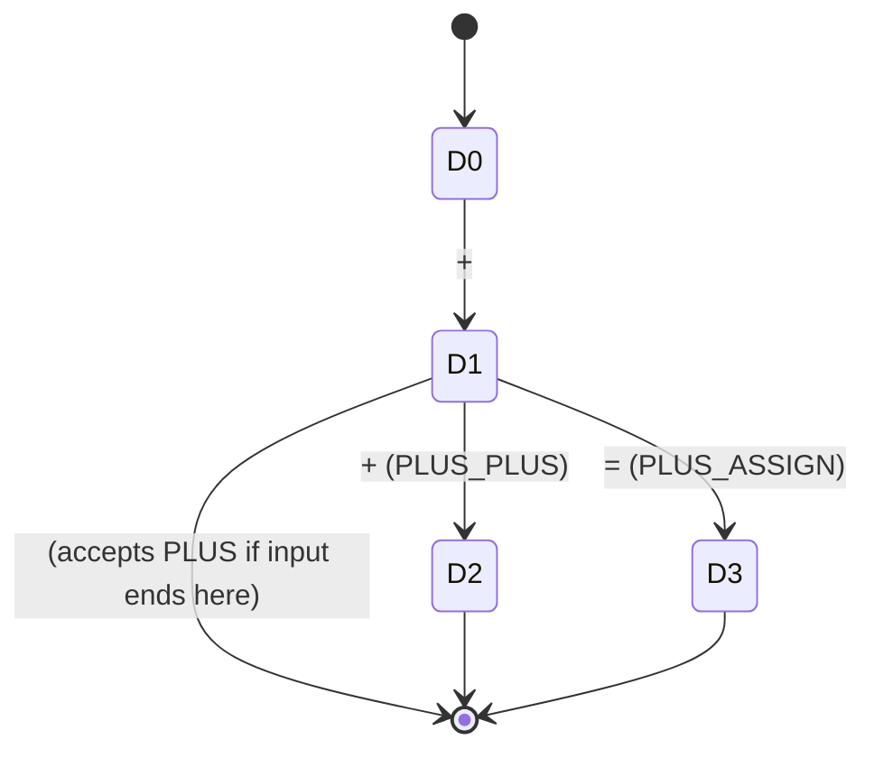

# Lexical Specification

This document is the formal counterpart to `src/clens/languages/c/token_rules.py`.
Where the two disagree, this file is wrong and should be fixed in the same commit
as whatever changed the code (see `.agents/skills/docs-deliverables/SKILL.md`).

## 1. Token classes

Notation: `[...]` is a character class, `?` optional, `*` zero-or-more, `+`
one-or-more, `|` alternation, `\|` etc. escape a literal character.

| Class | Formal regular expression | Example |
|---|---|---|
| `KEYWORD` | (see §3 — not a regex rule) | `while`, `struct`, `sizeof` |
| `IDENT` | `[A-Za-z_][A-Za-z0-9_]*` | `factorial`, `_tmp2` |
| `INT_LIT` | `0[xX][0-9A-Fa-f]+S? \| 0[bB][01]+S? \| (0[0-7]* \| [1-9][0-9]*)S?` where `S = ([uU][lL]?\|[lL][uU]?)?` | `42`, `0xFF`, `0b1010`, `0755`, `10UL` |
| `FLOAT_LIT` | `(F E? \| [0-9]+E) [FfLl]?` where `F = [0-9]*\.[0-9]+ \| [0-9]+\.` and `E = [eE][-+]?[0-9]+` | `3.14`, `1.0e-5`, `.5f`, `1.`, `1e10` |
| `STRING_LIT` | `"([^"\\\n] \| \\[^\n])*"` | `"hello\n"`, `""` |
| `CHAR_LIT` | `'([^'\\\n] \| \\[^\n])*'` | `'a'`, `'\t'`, `'\0'` |
| `OPERATOR` | literal alternation, longest first (§3) — `<= >= == != -> ++ -- && \|\| += -= *= /= %= = + - * / % < > ! & ~ ? : .` | `<=`, `->`, `+` |
| `DELIMITER` | `\{ \| \} \| \( \| \) \| \[ \| \] \| ; \| ,` | `{`, `;` |
| `LINE_COMMENT` | `//[^\n]*` | `// note` |
| `BLOCK_COMMENT` | `/\*.*?\*/` (non-greedy; `.` includes newline) | `/* a\nb */` |
| `WHITESPACE` | `[ \t\r\n]+` | (spaces, tabs, newlines) |
| `PREPROC` | `#[^\n]*` (tokenized whole, never expanded) | `#include "foo.h"` |
| `INVALID` | not matched by any rule above; the recovery path consumes exactly one character (R1.5) | `@`, `$` |
| `EOF` | sentinel; zero-width, emitted exactly once after the last real token | — |

Two categories are **recovery variants**, not separate token classes — they still
produce `STRING_LIT` / `BLOCK_COMMENT` tokens, but also raise a diagnostic:

| Recovery rule | Pattern | Fires when |
|---|---|---|
| Unterminated string (R1.6) | `"([^"\\\n]\|\\[^\n])*` (no closing `"` required) | The terminated `STRING_LIT` rule fails to find a closing quote before the next newline |
| Unterminated block comment (R1.7) | `/\*.*` (consumes to end of input) | The terminated `BLOCK_COMMENT` rule fails to find a closing `*/` anywhere in the remaining input |

Because both variants are tried only *after* their terminated counterpart, a
well-formed literal always wins; the unterminated form only ever fires when the
terminated one is provably impossible from that position.

## 2. From regexes to one recognizer

Standard compiler-construction pipeline for turning a set of regular expressions
into a single scanner:

1. **Thompson's construction** — each token class's regex becomes an NFA
   fragment: concatenation chains states, `|` adds parallel branches joined by
   ε-transitions, `*`/`+`/`?` add ε-loops/skips. All fragments share one start
   state, joined by ε-transitions, with each fragment's accepting state tagged
   with the token type it recognizes.
2. **Subset construction** — the NFA is determinized: each DFA state is the
   ε-closure of a set of NFA states. A DFA state is accepting if any NFA state
   in its set is accepting; when more than one is, the **first-listed** rule
   (§3) wins, which is exactly keyword-before-identifier and the priority
   ordering in `token_rules.py`.
3. **Hopcroft minimization** — merge DFA states that are behaviourally
   identical (same acceptance status, same transitions to equivalent states)
   into one. In practice this mostly collapses the many "not-yet-failed, but no
   accepting state reached" sink states for unrelated token families into a
   single dead/trap state.

## 3. Priority rules

Two rules resolve every ambiguity between token classes:

- **Maximal munch (R1.3).** The recognizer always prefers the longest match
  available at the current position. `<=` must never be reported as `<` then
  `=`.
- **Keyword before identifier (R1.4).** Keywords are not their own regex rule.
  The engine matches the longest identifier-shaped run first, then a second
  pass — a set-membership check against `languages/c/keywords.py` — retypes it
  to `KEYWORD` if it is one. A rule like `\bwhile\b` looks equivalent and is
  not: it would also fire inside `while_count`. Matching greedily first and
  reclassifying afterward is the only way to get both `while` → `KEYWORD` and
  `while_count` → `IDENT` from one identifier rule.

## 4. Implementation strategy actually used

`core/lexer_base.py` does not build or execute a literal DFA. It compiles one
Python `re` alternation — `(?P<r1>pattern1)|(?P<r2>pattern2)|...` — in the order
given by `languages/c/token_rules.py`, and calls `.match(text, pos)` in a loop
(D5).

Python's `re` engine is a backtracking matcher, not a DFA simulator: alternation
is resolved **leftmost-first**, not longest-match. That is a real difference
from the textbook DFA in §2, where every live branch is explored in parallel and
the *longest* one wins regardless of order. We recover identical externally
observable behaviour by construction, not by accident: every token family in
`token_rules.py` where one alternative's lexeme is a prefix of another's
(`<` / `<=`, `+` / `++` / `+=`, terminated / unterminated string, ...) is listed
**longest-alternative-first**, so the first alternative the backtracking engine
tries to match is always the one a DFA would have selected via longest match.
`tests/unit/test_lexer_base.py::test_earlier_rule_wins_at_same_position` and the
maximal-munch tests in `tests/unit/test_lexer_c.py` pin this down.

This buys a hand-written engine that is a few dozen lines instead of a
hand-rolled DFA simulator, at the cost of the ordering discipline above being
load-bearing — get it wrong and a test fails immediately, rather than silently
mis-tokenizing.

## 5. Worked example: NFA → DFA for `+`, `++`, `+=`

Three of our real `OPERATOR` alternatives, small enough to draw completely:
`PLUS` (`+`), `PLUS_PLUS` (`++`), `PLUS_ASSIGN` (`+=`).

### 5.1 Thompson's construction

One NFA fragment per alternative, all sharing start state `S` via ε-transitions:

```
        ε        +
   S ------> A0 ----> A1 (accept: PLUS)

        ε        +        +
   S ------> B0 ----> B1 ----> B2 (accept: PLUS_PLUS)

        ε        +        =
   S ------> C0 ----> C1 ----> C2 (accept: PLUS_ASSIGN)
```

### 5.2 Subset construction (NFA → DFA)

DFA states are ε-closures of NFA-state sets:

```
D0 = ε-closure({S})       = {S, A0, B0, C0}            (start, non-accepting)

D0 --'+'--> D1 = {A1, B1, C1}                            (accepting: PLUS)
D1 --'+'--> D2 = {B2}                                    (accepting: PLUS_PLUS)
D1 --'='--> D3 = {C2}                                    (accepting: PLUS_ASSIGN)

D2, D3: no outgoing transitions on the alphabet {+, =} → implicit trap on
anything else, same as D0/D1 on any input not shown above.
```



Note `D1` is simultaneously **accepting** (for `PLUS`) and has outgoing
transitions. This is the DFA-level picture of maximal munch: a scanner sitting
in `D1` has already seen a valid `+` token, but keeps consuming because more
input could extend it to a longer valid token. It only commits to the shorter
match if the *next* character has no transition from `D1` — e.g. `+ ;` commits
to `PLUS` at the space, `++` continues to `D2` and commits to `PLUS_PLUS`.

### 5.3 Hopcroft minimization

Reachable states: `{D0, D1, D2, D3}` plus one implicit trap state `T` for any
character with no transition from the current state (e.g. `+3`: `D1` has no
transition on `3`, so the scanner falls off into `T`, and the maximal-munch
algorithm backtracks to the last accepting state it passed through, `D1`,
re-scanning from there — which is exactly the master-regex engine's behaviour
of matching once and moving `pos` to the end of the match).

Minimization asks whether any two states are behaviourally indistinguishable
(same acceptance, and transitions land in equivalent states for every possible
input). Here:

- `D0` is non-accepting with a transition on `+`; no other state matches that.
- `D1` is accepting-with-transitions (on `+` and `=`); unique.
- `D2` and `D3` are both accepting, with no outgoing transitions — but they are
  **not** merged, because they are labelled with different token types
  (`PLUS_PLUS` vs `PLUS_ASSIGN`) and a scanner must be able to tell them apart.
  Minimization only merges states that agree on *all* observable behaviour,
  including which token type an accepting state reports.
- All of `T`'s incoming edges (from `D0`, `D1`, `D2`, `D3` on every
  unhandled input) collapse into the single trap state, since none of them
  distinguish it further.

So this DFA is already minimal at 4 live states plus one trap: `{D0, D1, D2, D3,
T}`.
